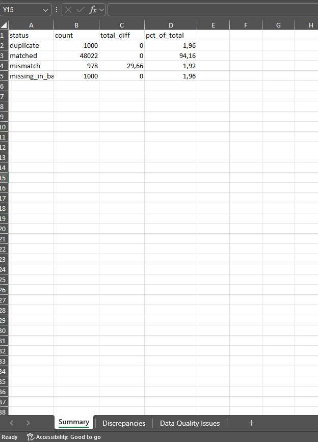
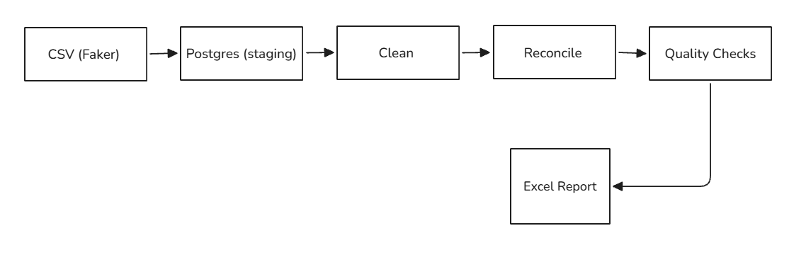
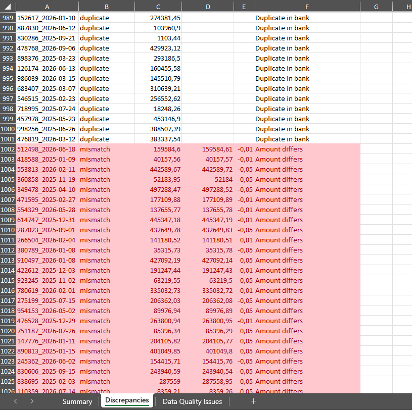
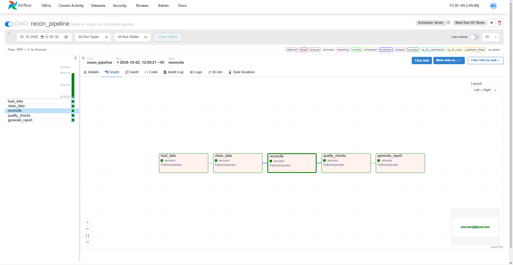

# Bank vs Ledger Reconciliation Pipeline

A demo data engineering pipeline that reconciles transactions between two data sources (a "bank" feed and an internal "ledger"), flags mismatches and data quality issues, and produces an Excel report. Built to mirror a real finance-automation task: matching records across systems, catching discrepancies, and turning a manual multi-hour process into something that runs in minutes.


<!-- PLACEHOLDER: screenshot of the Summary sheet in the generated Excel report -->

## What it does

1. Generates ~50,000 synthetic "bank" and "ledger" records with intentional errors (mismatched amounts, missing records, duplicates, inconsistent date formats).
2. Loads both sources into PostgreSQL.
3. Cleans and normalizes the data (parses dates, standardizes amounts).
4. Reconciles the two sources: matches, mismatches, duplicates, and records missing on either side.
5. Runs data quality checks (nulls, duplicates, out-of-range values, unparseable dates).
6. Generates a formatted Excel report with a summary, a discrepancy breakdown, and a data quality sheet.
7. Orchestrates all of the above with Apache Airflow, with a Telegram notification on success/failure.

## Tech stack

Python, pandas, PostgreSQL, Docker, Apache Airflow, XlsxWriter, pytest.

## Architecture


<!-- PLACEHOLDER: simple diagram — CSV generation -> Postgres (staging) -> clean -> reconcile -> quality checks -> Excel report, orchestrated by Airflow -->

recon-pipeline/
├── docker-compose.yaml # postgres + airflow (webserver, scheduler, metadata db)
├── dags/
│ └── recon_dag.py # Airflow DAG: load -> clean -> reconcile -> quality_checks -> report
├── src/
│ ├── generate_data.py # synthetic data generator
│ ├── load.py # CSV -> staging tables
│ ├── clean.py # staging -> clean tables (parsing, normalization)
│ ├── reconcile.py # core matching logic
│ ├── quality_checks.py # data quality checks
│ └── report.py # Excel report generation
├── sql/
│ └── init.sql # schema and table definitions
├── tests/
│ └── test_reconcile.py # unit tests for reconciliation logic
├── requirements.txt
├── .env # local DB connection (not committed)
└── .env.airflow # DB connection for Airflow containers (not committed)


## Prerequisites

- Docker Desktop (with WSL2 backend on Windows)
- Python 3.11+ and a virtual environment
- A Telegram bot token and chat ID (optional, only needed for notifications — see below)

## Setup

1. Clone the repository and create a virtual environment:
```bash
   git clone <repo-url>
   cd recon-pipeline
   python -m venv venv
   venv\Scripts\activate        # Windows
   source venv/bin/activate     # Mac/Linux
   pip install -r requirements.txt
```

2. Create a `.env` file in the project root (used when running scripts locally, outside Docker):

```
DB_HOST=127.0.0.1
DB_PORT=5433
DB_NAME=recon_db
DB_USER=recon
DB_PASSWORD=recon_pass
```

3. Create a `.env.airflow` file (used inside the Airflow containers, where Postgres is reached by service name, not localhost):

```
DB_HOST=postgres
DB_PORT=5432
DB_NAME=recon_db
DB_USER=recon
DB_PASSWORD=recon_pass
TELEGRAM_BOT_TOKEN=your_token_here
TELEGRAM_CHAT_ID=your_chat_id_here
```


## Running the pipeline manually (without Airflow)

This is the simplest way to run everything end to end and see the report:

```bash
docker compose up -d postgres
```

Wait a few seconds for Postgres to become healthy, then run each step in order:

```bash
python src/generate_data.py
python src/load.py
python src/clean.py
python src/reconcile.py
python src/quality_checks.py
python src/report.py
```

The Excel report will be generated at `reports/reconciliation_report.xlsx`.


<!-- PLACEHOLDER: screenshot of the Discrepancies sheet with red-highlighted mismatches -->

## Running the full pipeline with Airflow

```bash
docker compose up -d
```

First startup takes a few minutes (Airflow installs Python dependencies from `requirements.txt`). Check progress with:

```bash
docker compose logs airflow-webserver --tail 50
```

Once you see `Listening at: http://0.0.0.0:8080`, open:

http://localhost:8080


Log in with `admin` / `admin`, find the `recon_pipeline` DAG, enable it with the toggle, and trigger it manually with the play button.


<!-- PLACEHOLDER: screenshot of the DAG graph view in the Airflow UI, ideally with all tasks green -->

## Running tests

```bash
cd tests
pytest -v
```

## Results

Manual reconciliation of ~50,000 records would typically take a business day. This pipeline reconciles the same volume in under a few minutes end to end, including data quality checks and report generation.

## Notes

- Data is synthetic, generated with Faker specifically for this demo — no real financial data is used anywhere in this project.
- The reconciliation logic matches on `account_id` + `amount` + `date` (with a ±1 day window for mismatches), and separately flags exact duplicates within each source.